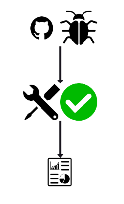
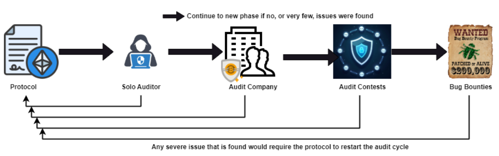
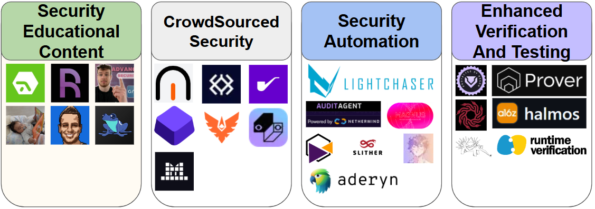

# Chapter 8: Smart Contract Security and Auditing

## Introduction

This chapter covers vulnerability patterns, risk assessment methodologies, and best practices for hardening smart contracts. Within it, we will also discuss the role of audits in trust minimization and protocol resilience.

### Topics Covered

- Security in the Blockchain Ecosystem
- Common Smart Contract Vulnerabilities
- Risk Assessment Methodologies
- Security Best Practices
- Smart Contract Auditing
- Blockchain Security Today

### Prerequisites

- Solidity knowledge
- Understanding of testing concepts
- Basic DeFi knowledge (e.g. ERC20)
- Can cry in silence

## Security in the Blockchain Ecosystem

Security is protection from, or resilience against, potential harm.

The Blockchain Ecosystem need security and protection from harm because of two main aspects:

- Blockchain is permissionless → anyone can create anything
- Anything can be given a financial value → everything can be FinTech

How to think of Blockchain technology:

- MCaaS - Manufacturing Cars as a Service
- BaaS - Banks as a Service
- BRaaS - Brokerage as a Service
- CaaS - Casinos as a Service

In all of the mentioned interpretations, for a company to launch such a product, they would require a form of auditing. Either financial audits, software audits or personal security audits. One cannot simply create bank.

While in the blockchain ecosystem anyone can create anything, special care to security must still be given as to avoid financial loss.

## Common Smart Contract Vulnerabilities

Over the years, several types of issues were seen in the wild, which lead to a broad and unstandardized classification of vulnerabilities. This is still the state today.

There was an attempt to create a Smart Contract Weakness Classification (SWC) standard, it failed and [was abandoned in 2020](https://swcregistry.io/).

Relevant and generally accepted vulnerability classifications:
- `Access Control`: critical functions that should only be executed by privileged entities are mistakenly left ungated, callable by anyone
- `Lack of Input Validation`: unvalidated user input data allows unintended behavior
- `Misconfiguration`: critical variables of the victim contract are misconfigured
- `Inadequate Price Dependency`: token price calculation has dependency on a manipulable source
- `Precision Loss`: rounding errors caused by divisions may cause unexpected behavior
- `Reentrancy`: contract is callable back into (re-entered) before its previous execution is completed, reaching state inconsistencies logic issues
- `Logic Bug`: contract core business logic is not implemented according to protocol intended specifications and intention

### Exercises

To better understand how attackers abuse vulnerabilities to hack projects, participants have 2 exercises where they try to get into an attacker's mindset and exploit a specific, mock, contract. Thinking as an attacker has the benefit of being able to then think on how to stop the attack. This is also known as defensive programming.

Solutions to the exercises can be seen on the [accompanying PDF presentation slides](./resources/08-security-auditing/ETH-Cluj-2025-Security-Workshop.pdf).

#### Exercise #1 – The Kingdom

**Description**: In a far far away land, governance has chosen to reward its most loyal subjects. The Treasury contract was deployed and gold coins were added for each subject to claim. An angry subject, which was omitted from the reward list, has become an attacker and wants to steal as many coins as possible.

**Task**: In the `Kingdom.t.sol::stealGoldCoins` function, implement what is necessary for the attacker to have at the end of the function call 56 full gold coins.

_You cannot use any vm cheat codes_

Task repo: https://github.com/abarbatei/Kingdom-E4E-ETHCluj-2025/tree/main

#### Exercise #2 – The TooEasyBox

**Description**: The `TooEasyBox` contract is used to house packages (ETH) for users. The currier places funds for each to withdraw. An attacker sees that there are a lot of packages (ETH) in the `TooEasyBox` and sets out to steal it all.

**Task**: In the `Playground.t.sol::hackerGonnaHack` function, implement what is necessary for the attacker to have stolen, at the end of the function call, all the ETH from the `TooEasyBox`.

_You cannot use any vm cheat codes_

Task repo: https://github.com/abarbatei/TooEasyBox-E4E-ETHCluj-2025/tree/main

### Reentrancy

The second exercise highlights a classical reentrancy issue. However, reentrancy issues can be more complex and nuanced:

- `Classical Reentrancy`: reentering into the same function within the same contract
- `Cross-function Reentrancy`: reentering into a different function that shares state with the vulnerable one 
- `Cross-contract Reentrancy`: reentrancy occurs across multiple contracts in a system
- `Cross-chain Reentrancy`: reentrancy across chains during asynchronous bridge callbacks
- `Read-only (View) Reentrancy`: reentrancy via view or pure functions that affect off-chain reads or conditional logic

It is important to note, that all previously mentioned vulnerability types have several variations and branches, each with varying degrees. As a developer, you need to, at least, be aware of them at a high level in order to account for them.

## Risk Assessment Methodologies

Vulnerabilities introduce issues and issues come with a varying degree of security risk. Risk is assigned by __how severe an issue is__.

Depending on the likelihood of the issue appearing and its impact (damage), an issue is in one of four risk categories or severities: 🔴Critical, 🟠High, 🟡Medium, 🟢Low or 🔵Informational/QA.

|      Severity      | Impact: High | Impact: Medium | Impact: Low |
|:-------------------|:-------------|:--------------|:-------------|
|  Likelihood: High  | 🔴Critical  |  🟠High       | 🟡Medium     |
| Likelihood: Medium | 🟠High      |  🟡Medium     | 🟢Low        |
|  Likelihood: Low   | 🟡Medium    |  🟢Low        | 🟢Low        |

### Impact

- **High** - leads to a significant loss of assets in the protocol or significantly harms a group of users.
- **Medium** - only a small amount of funds can be lost or a functionality of the protocol is affected.
- **Low** - any kind of unexpected behavior that's not so critical.

### Likelihood

- **High** - direct attack vector; the cost is relatively low to the amount of funds that can be lost.
- **Medium** - only conditionally incentivized attack vector, but still relatively likely.
- **Low** - too many or too unlikely assumptions; provides little or no incentive.

### Actions required by severity level

- 🔴**Critical** - issue **must** be fixed
- 🟠**High** - issue **must** be fixed
- 🟡**Medium** - issue **should** be fixed
- 🟢**Low** - issue **could** be fixed

### Informational findings

**Informational** findings encompass recommendations to enhance code style, operations alignment with industry best practices, gas optimizations, adherence to documentation, standards, and overall contract design.

Informational findings typically have minimal impact on code functionality or security risk. 

Evaluating all vulnerability types, including informational ones, is crucial to ensure the security, robustness and reliability of a project.

### Quiz on Loss Of Funds

The following quiz is used to discuss how to evaluate impact with Loss Of Funds:

How would you rate impact (none, low, medium, high, can't tell) in these situations?

- A user loses 50$
- A user loses 50$ out of a 500$ amount
- A user loses 50$ out of a 5,000,000$ amount
- A user loses 50$ per year
- A user loses 50$ per year out of a 500$ amount
- A user loses 50$ per year out of a 5,000,000$ amount
- A user loses 50$ per day
- A user loses 50$ per day out of a 500$ amount
- A user loses 50$ per day out of a 5,000,000$ amount
- A user suffers a theft of 50$
- A user suffers a theft of 50$ out of a 500$ amount
- A user suffers a theft of 50$ out of a 5,000,000$ amount
- A user suffers a rounding error loss of 50$
- A user suffers a rounding error loss of 50$ out of a 500$ amount
- A user suffers a rounding error loss of 50$ out of a 5,000,000$ amount

Solutions to the exercises can be seen on the [accompanying PDF presentation slides](./resources/08-security-auditing/ETH-Cluj-2025-Security-Workshop.pdf).

#### Severity Assessment Takeaways

- Assessing the impact on loss of funds depends on the percentage of victim’s perceived loss and on how the loss occurred
- Time constraints are irrelevant to assigning impact, they are relevant in assigning severity.
- Theft is high impact
- Rounding errors can be in between low - high impact, depending on % lost
- Guidelines are subjective and can vary. Examples:
  - Sherlock defines [significant loss as](https://docs.sherlock.xyz/audits/judging/guidelines): `users lose more than 1% and more than $10 of their principal`
  - Immuenfi defines direct [theft of any user funds as a Critical Severity](https://immunefi.com/immunefi-vulnerability-severity-classification-system-v2-3/) (overrides likelihood)

## Security Best Practices

The following is a non-exhaustive list of best practices when developing any protocol:

- Limit user actions as much as possible
  - Actions such as allowing users to operate on-behalf-of others can introduce issues
  -  If a user has no incentive to call a function, do not allow that function to be called by users
- Move as much logic as possible off-chain
  - e.g. if smart contract requires a sorted list to work, check that the user-provided list is sorted, do not sort it on-chain
- Always validate user-provided inputs (and protocol inputs)
- First think in terms of happy path, then in terms of edge cases
  - e.g. how does the protocol behave in black swan type events?
- Each and every rounding error (division) in the protocol must be intentionally looked at and set in favor of the protocol
- If multiple decimal tokens are supported, note the decimal of each and every variable in the code
- Check each and every subtraction for the possibility of underflow
- Convert subtractions to additions where possible. e.g.

|                  | Code Example                               |
|------------------|--------------------------------------------|
| **Instead of**   | `currentTime - duration > startTime`       |
| **Use**          | `currentTime > startTime + duration`       |

- Always use "safe" library code for any operations where they exist
  - e.g [`safeCasting`](https://docs.openzeppelin.com/contracts/5.x/api/utils#SafeCast), [`safeTransfer`](https://docs.openzeppelin.com/contracts/5.x/api/token/erc20#SafeERC20), [`forceApprove`](https://docs.openzeppelin.com/contracts/5.x/api/token/erc20#SafeERC20-forceApprove-contract-IERC20-address-uint256-)
- Reuse as much already-audited library code as possible
  - e.g OpenZeppelin, Solady, Solmate
- External integrations are issue points. Be as intimate with the dependency as possible
  - e.g. if integrating with DEXs, slippage and deadlines controls are necessary
- Follow the official [Solidity docs style-guide](https://docs.soliditylang.org/en/latest/style-guide.html) as it is easier to spot issues in a properly organized codebase
- Keep the code as simple and as small as possible
- Generally think as an attacker
  - Identify each protocol invariant and try to break it
  - See if breaking it can be abused to damage the protocol
- Testing
  - Have 100% test coverage
  - Add fuzz testing and invariant testing
  - Formally verify the code
- Avoid security by obscurity because it does not work. Best it can do is slightly delay a hack but also delay a whitehat in finding issues
- Check all existing security checklists for issues related to your protocol type. Some checklist or resource examples:
  - https://docs.soliditylang.org/en/latest/security-considerations.html
  - https://solodit.cyfrin.io/checklist
  - https://scsfg.io/developers/
  - https://dacian.me/defi-liquidation-vulnerabilities
- Have both on-chain and off-chain components audited

## Smart Contract Auditing

Smart contract auditing is the process of reviewing and analyzing the code of a smart contract to identify vulnerabilities, security issues, or potential bugs. 

A variation of E.W. Dijkstra famous quote on testing best describes what smart contract auditing is:

"Smart contract auditing can be used to show the presence of bugs, but never to show their absence"

<table>
<tr>
<td>

A smart contract auditor:  
- Reviews code looking for issues  
- Makes POC (proof-of-concept) tests to showcase the issues  
- Suggests fixes  
- Ensures the fixes are implemented correctly  
- Compiles all the issues, suggestions and fixes into a report that is given to the client  

</td>
<td>

</td>
</tr>
</table>

Ideally, a project goes through several audits and type of audits. After each audit type, if important issues are found, the cycle should be reiterated.

## Blockchain Security Today

In the current blockchain security ecosystem, improvements and effort has been divided into four major categories: Educational content, CrowdSourced Security, Security Automation and Enhanced Verification/Testing.

### Educational Content

Security educational content has slowly, but surely, increased security awareness and overall market resilience. It is an essential part of keeping high standards.

Relevant security educational source:

- https://updraft.cyfrin.io/courses 
- https://www.rareskills.io/ 
- https://www.youtube.com/@0xOwenThurm 
- https://dacian.me/ 
- https://x.com/RealJohnnyTime 
- https://www.youtube.com/@PatrickAlphaC 
- https://newsletter.blockthreat.io/

### CrowdSourced Security

CrowdSourced security is represented by either audit contests/competitions or bug bounties within the space.

An audit contest or competition, is a decentralized, timeboxed code review, where projects offer a capped rewards pool that is distributed to auditors at the end of the event based on bug report submissions. This is different from classical bug bounties, where there is not timebox but the rewards are distributed on different terms.

An important aspect of crowed sourced security is that there is no barrier of entry, anyone can participate in on-going, public, competitions or bounties.

Example of platforms that host crowd sourced security events:

- https://immunefi.com/
- https://cantina.xyz/ 
- https://sherlock.xyz/ 
- https://code4rena.com/ 
- https://codehawks.com/ 
- https://hackenproof.com/ 
- https://hats.finance/ 

### Security Automation

From an automation point of view, the market has focused on:
- static analyzers (e.g. slither, lightChaser, 4naly3er, aderyn)
- AI agents (e.g. AuditAgent or Savant)
- general security tooling orchestration (Magnus)

The mentioned resources:

- https://www.lightchaser.online/ 
- https://auditagent.nethermind.io/ 
- https://immunefi.com/blog/all/introducing-magnus/ 
- https://savant.chat/ 
- https://github.com/crytic/slither
- https://github.com/Picodes/4naly3er 
- https://github.com/Cyfrin/aderyn/tree/dev 

### Enhanced Verification And Testing

The state of the art in testing and enhanced verification is done via:
- formal verification
- fuzz testing

The two procedures are key components in identifying security issues of a protocol. This area is under constant development.

Example of formal verification tools or fuzz testing frameworks:

- https://getrecon.xyz/
- https://github.com/Certora/CertoraProver
- https://runtimeverification.com/#tools-section
- https://github.com/crytic/medusa
- https://github.com/a16z/halmos
- https://github.com/crytic/echidna/tree/master 

## Conclusion

- Security is essential to Blockchain technology due to its FinTech nature
- Blockchain Security as a field is still new and not fully standardized
- Millions of dollars worth of assets are stolen each year due to smart contract vulnerabilities
- Most vulnerabilities are known but not internalized by developers, leading to the need for multiple audits
- Best practices will always reduce the chances of hacks
- Smart Contract Auditing will exists as long as public Blockchain technology exists

## References

- https://swcregistry.io/
- https://drive.google.com/file/d/1Cx1vCTv7v-U_ICDinE9W2JwjQULMepCn/view (Chainlight 2023 report)
- https://blog.chainlight.io/web3-hack-postmortem-2024-2b8ed0116c93
- https://docs.sherlock.xyz/audits/judging/guidelines
- https://immunefi.com/immunefi-vulnerability-severity-classification-system-v2-3/
- https://docs.openzeppelin.com/contracts/5.x/api/token/erc20#SafeERC20
- https://docs.soliditylang.org/en/latest/style-guide.html
- https://scottschober.com/bug-bounties-created-equal/
- https://docs.soliditylang.org/en/latest/security-considerations.html
- https://solodit.cyfrin.io/checklist
- https://scsfg.io/developers/
- https://dacian.me/defi-liquidation-vulnerabilities

